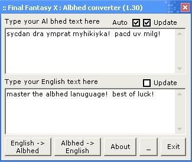



## Final Fantasy X Albhed Converter

### Description

Converts Albhed into English, and English into Albhed. Added comments and scrollbars. Any improvements appriciated!. Added on Auto Convert when sets focus, makes it abit quicker and less teadeious.
 
### More Info
 

             |
---                |---
**Submitted On**   |2002-08-27 18:17:36
**By**             |[Graham Lee Compton](https://github.com/Planet-Source-Code/PSCIndex/blob/master/ByAuthor/graham-lee-compton.md)
**Level**          |Beginner
**User Rating**    |4.5 (18 globes from 4 users)
**Compatibility**  |VB 3\.0, VB 4\.0 \(16\-bit\), VB 4\.0 \(32\-bit\), VB 5\.0, VB 6\.0
**Category**       |[Encryption](https://github.com/Planet-Source-Code/PSCIndex/blob/master/ByCategory/encryption__1-48.md)
**World**          |[Visual Basic](https://github.com/Planet-Source-Code/PSCIndex/blob/master/ByWorld/visual-basic.md)
**Archive File**   |[Final\_Fant1234038282002\.zip](https://github.com/Planet-Source-Code/graham-lee-compton-final-fantasy-x-albhed-converter__1-38333/archive/master.zip)

